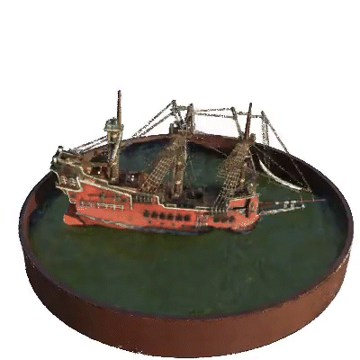

# torch-NeRF

## Overview

Pytorch implementation of **NeRF: Representing Scenes as Neural Radiance Fields for View Synthesis** (Mildenhall et al., ECCV 2020 Oral, Best Paper Honorable Mention) and its extension to follow-up research projects.

|  |
|:--:|
|*NeRF Overview.* Figure from the [project page](https://www.matthewtancik.com/nerf) of NeRF: Representing Scenes as Neural Radiance Fields for View Synthesis, Mildenhall et al., ECCV 2020. |

## Getting Started

To configure the Python virtual environment and install dependencies, open the shell and run the following commands:

```
# Clone the repository
git clone https://github.com/DveloperY0115/torch-NeRF.git
cd torch-NeRF

# Create virtual environment
virtualenv venv -p=3.8
source venv/bin/activate

# Install dependencies
pip3 install -r requirements.txt
```

You may use any tools of your preference such as `conda`. Our code should reproduce the results regardless of which dependency management tool is used as long as the same versions of dependencies are installed.

To download the synthetic dataset for training, issue the following command in the shell:

```
sh scripts/data/download_example_data.sh
```

This should create `data` directory under the project root (`torch-NeRF` by default) and download datasets provided by the authors of NeRF (ECCV 2020).

The configuration is set for `lego` scene included in `Blender` dataset. Executing the following command initiates training:

```
python torch_nerf/runners/run_train.py
```

Once a scene representation is learned, you can render it using the script `run_render.py` under `torch_nerf/runners` directory. Note that you need to specify the path to the checkpoint file by modifying the `yaml` file under `config/train_params`.

The rendering script stores rendered images in `render_out` directory under the project root. To create a video from the collection of consecutive frames, use the script `scripts/utils/create_video.py`.

## Gallery

**NOTE: All images shown below are produced using our code.**
<p align="middle">
  
  
  
  
</p>

<p align="middle">
  
  
  
  
</p>

<p align="middle">
  
  
  
</p>

## Progress

- [x] Implement the base model and volume rendering pipeline proposed in [NeRF: Representing Scenes as Neural Radiance Fields for View Synthesis (ECCV 2020)](https://www.matthewtancik.com/nerf).
- [ ] Extend the implementation to [Mip-NeRF: A Multiscale Representation for Anti-Aliasing Neural Radiance Fields (ICCV 2021)](https://arxiv.org/abs/2103.13415).
- [ ] Extend the implementation to [Mip-NeRF 360: Unbounded Anti-Aliased Neural Radiance Fields (CVPR 2022)](https://jonbarron.info/mipnerf360/).
- [ ] Extend the implementation to [NeRF in the Dark: High Dynamic Range View Synthesis from Noisy Raw Images (CVPR 2022)](https://bmild.github.io/rawnerf/).
- [ ] Extend the implementation to [Neural 3D Scene Reconstruction with the Manhattan-world Assumption (CVPR 2022)](https://zju3dv.github.io/manhattan_sdf/).
- [ ] Extend the implementation to [Urban Radiance Fields (CVPR 2022)](https://urban-radiance-fields.github.io).
- [ ] Extend the implementation to [Block-NeRF: Scalable Large Scene Neural View Synthesis (CVPR 2022)](https://waymo.com/research/block-nerf/).
- [ ] Adapt techniques for accelerating training \& inference. The selected candidates are listed below (subject to change):
  - [SNeRG (ICCV 2021)](https://phog.github.io/snerg/)
  - [KiloNeRF (ICCV 2021)](https://arxiv.org/abs/2103.13744)
  - **[Instant-NGP (SIGGRAPH 2022)](https://nvlabs.github.io/instant-ngp/)**
  - **[Variable Bitrate Neural Fields (SIGGRAPH 2022)](https://nv-tlabs.github.io/vqad/)**
  - [Point-NeRF (CVPR 2022)](https://xharlie.github.io/projects/project_sites/pointnerf/index.html)
  - **[TensoRF (ECCV 2022)](https://arxiv.org/abs/2203.09517)**
