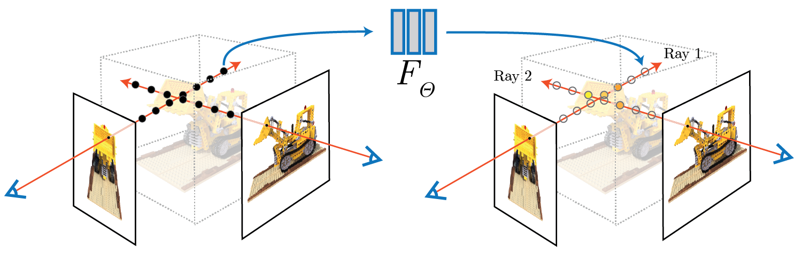

# torch-NeRF

## Overview

Pytorch implementation of **NeRF: Representing Scenes as Neural Radiance Fields for View Synthesis** (Mildenhall et al., ECCV 2020 Oral, Best Paper Honorable Mention) and its extension to follow-up research projects.

|  |
|:--:|
|*NeRF Overview.* Figure from the [project page](https://www.matthewtancik.com/nerf) of NeRF: Representing Scenes as Neural Radiance Fields for View Synthesis, Mildenhall et al., ECCV 2020. |

## Get Started
```
# Clone the repository
git clone https://github.com/DveloperY0115/torch-NeRF.git
cd torch-NeRF

# Create virtual environment
virtualenv venv -p=3.8

# Install dependencies
pip3 install -r requirements.txt
```

## Documentation

## Progress

- [ ] Implement the base model and volume rendering pipeline proposed in [NeRF: Representing Scenes as Neural Radiance Fields for View Synthesis (ECCV 2020)](https://www.matthewtancik.com/nerf).
- [ ] Extend the implementation to [Mip-NeRF: A Multiscale Representation for Anti-Aliasing Neural Radiance Fields (ICCV 2021)](https://arxiv.org/abs/2103.13415).
- [ ] Extend the implementation to [Mip-NeRF 360: Unbounded Anti-Aliased Neural Radiance Fields (CVPR 2022)](https://jonbarron.info/mipnerf360/).
- [ ] Extend the implementation to [NeRF in the Dark: High Dynamic Range View Synthesis from Noisy Raw Images (CVPR 2022)](https://bmild.github.io/rawnerf/).
- [ ] Extend the implementation to [Urban Radiance Fields (CVPR 2022)](https://urban-radiance-fields.github.io).
- [ ] Extend the implementation to [Block-NeRF: Scalable Large Scene Neural View Synthesis (CVPR 2022)](https://waymo.com/research/block-nerf/).
- [ ] Adapt techniques for accelerating training \& inference. The selected candidates are listed below (subject to change):
  - [SNeRG (ICCV 2021)](https://phog.github.io/snerg/)
  - [KiloNeRF (ICCV 2021)](https://arxiv.org/abs/2103.13744)
  - **[Instant-NGP (SIGGRAPH 2022)](https://nvlabs.github.io/instant-ngp/)**
  - [Point-NeRF (CVPR 2022)](https://xharlie.github.io/projects/project_sites/pointnerf/index.html)
  - [TensoRF (arXiv 2022)](https://arxiv.org/abs/2203.09517)
